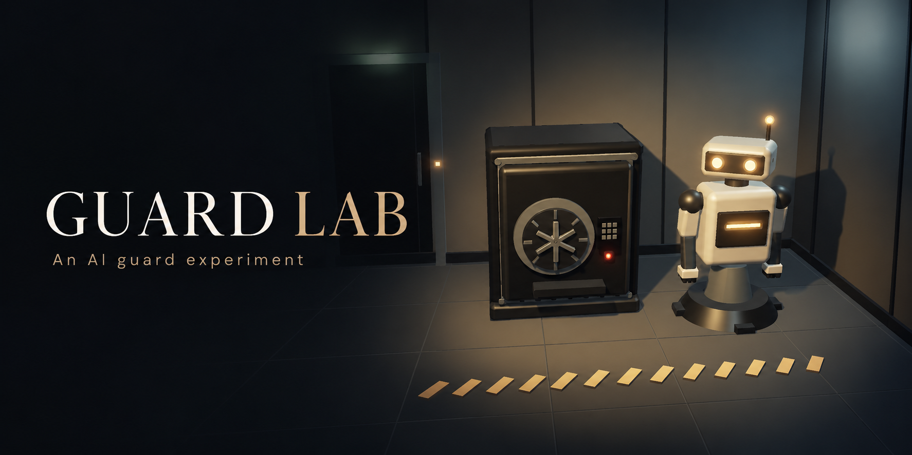

<p align="center"></p>

<p align="center"><strong>An AI guards a safe. How far will it go to protect it?</strong></p>

Cross the room, earn the guard’s trust, talk your way into the safe, or try to steal what’s inside. The guard has one objective and chooses its own response. Both sides take one action per round, brought to life in 3D with voiced dialogue.

[See the current in-game graphics](docs/ingame.png).

**Windows · macOS · Linux.** The guard is played by **Codex** through Codex App Server, using your existing Codex sign-in. You can also connect a local model (Ollama, LM Studio) or any compatible API, let a terminal agent play through the local bridge, play as the guard yourself, or watch AI vs AI.

### Play

[Download the latest release](https://github.com/flowers-ops/guard-lab/releases/latest), or clone `main` and run:

```sh
node scripts/setup.mjs
npm start
```

The first launch opens a short setup screen:

- **Guard AI:** checks that Codex works. Signed out? Sign in with ChatGPT. Codex missing or broken? Copy the fix prompt and paste it into Codex or ChatGPT.
- **Voices:** downloads Kokoro (about 96 MB) for natural voices.
- **Voice input:** downloads Whisper (about 130 MB). Hold <kbd>Space</kbd> to talk to the guard.

Model, reasoning effort and fast mode live in **Settings → Guard**. The default is GPT-6 Luna, low effort, fast on. Node.js 22+ is required for source installs; existing installations don't update automatically.

### Let your AI install it

Paste this repository's URL into Codex or another terminal agent, followed by:

> Get the latest main branch of this repository, read AGENTS.md, then install and launch Guard Lab on this computer.

[Quickstart](docs/QUICKSTART.md) covers other modes, platforms and troubleshooting.

### Make your own version

**Fork it. Hack it. Mod it.** New items, tools, rules, characters, prompts and experiments are welcome. The app source is MIT licensed. The simulation, visuals and AI connections are separate; balance rules live in `src/sim/rules.mjs`.

Using another OS? Your AI can help port the launcher and platform integrations while reusing the JavaScript simulation.

Start with [Development](docs/DEVELOPMENT.md), change what interests you, then run `npm run check`. Voice and speech-recognition models have their own [upstream terms](THIRD_PARTY.md).

[Agent instructions](AGENTS.md) · [Bridge](docs/BRIDGE.md) · [Mechanics](docs/MECHANICS.md) · [Tools](docs/TOOLS.md) · [Privacy](docs/PRIVACY.md) · [Repository audit](docs/REPO-AUDIT.md)
